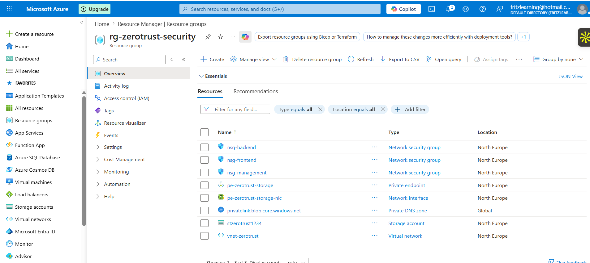
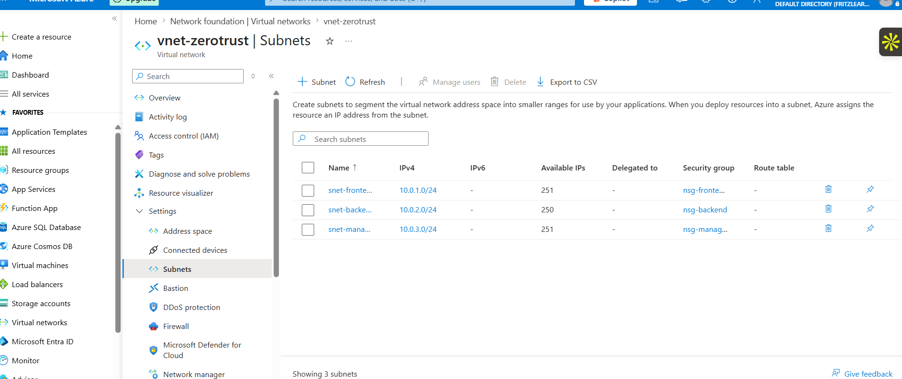
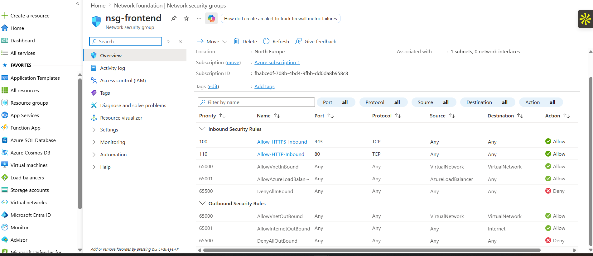
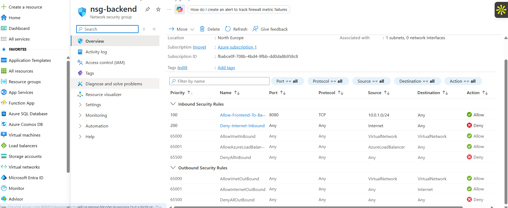
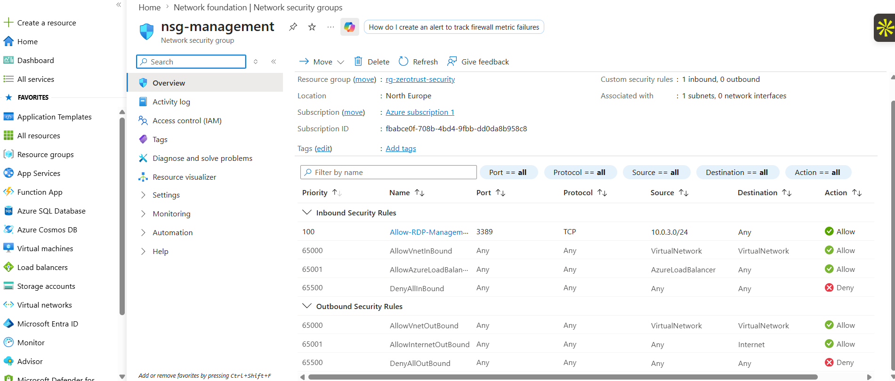
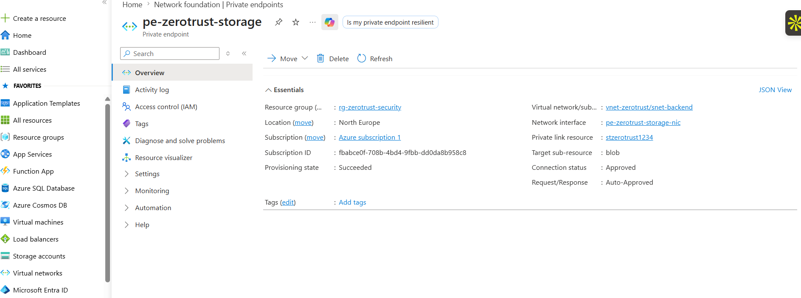
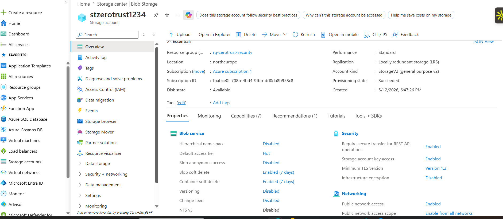

# Azure Zero Trust Network Security

## Overview
This project implements a **Zero Trust Network Security** architecture on Microsoft Azure. Zero Trust operates on the principle of "never trust, always verify" — no user, device, or network segment is trusted by default, even inside the corporate network.

## Architecture
rg-zerotrust-security
├── vnet-zerotrust (10.0.0.0/16)
│   ├── snet-frontend    (10.0.1.0/24) ←→ nsg-frontend
│   ├── snet-backend     (10.0.2.0/24) ←→ nsg-backend
│   └── snet-management  (10.0.3.0/24) ←→ nsg-management
├── stzerotrust1234 (Storage Account)
└── pe-zerotrust-storage (Private Endpoint → blob)

## What I Built
- **Virtual Network (VNet)** with 3 security zones
- **Network Security Groups (NSGs)** with custom inbound/outbound rules per subnet
- **Private Endpoint** for Azure Blob Storage — eliminating public internet exposure
- **Network segmentation** enforcing least privilege between zones

## Security Controls Implemented

| Control | Implementation |
|---------|---------------|
| Network Segmentation | 3 dedicated subnets per security zone |
| Traffic Control | NSG rules per subnet with explicit allow/deny |
| Zero Internet Exposure | Private Endpoint for storage account |
| Admin Access Control | RDP restricted to management subnet only |
| Defense in Depth | Multiple security layers across all subnets |

## NSG Rules Summary

### nsg-frontend
| Priority | Rule | Port | Action |
|----------|------|------|--------|
| 100 | Allow-HTTPS-Inbound | 443 | Allow |
| 110 | Allow-HTTP-Inbound | 80 | Allow |
| 65500 | DenyAllInBound | * | Deny |

### nsg-backend
| Priority | Rule | Port | Action |
|----------|------|------|--------|
| 100 | Allow-Frontend-To-Backend | 8080 | Allow |
| 200 | Deny-Internet-Inbound | * | Deny |
| 65500 | DenyAllInBound | * | Deny |

### nsg-management
| Priority | Rule | Port | Action |
|----------|------|------|--------|
| 100 | Allow-RDP-Management-Only | 3389 | Allow |
| 65500 | DenyAllInBound | * | Deny |

## Screenshots

### Resource Group Overview

### VNet Subnets

### NSG Frontend Rules

### NSG Backend Rules

### NSG Management Rules

### Private Endpoint

### Storage Account

## Technologies Used
- Microsoft Azure Virtual Network (VNet)
- Azure Network Security Groups (NSGs)
- Azure Private Endpoints
- Azure Private DNS Zones
- Azure Blob Storage
- Azure Resource Manager (ARM)

## Key Learnings
- Network segmentation is the foundation of Zero Trust architecture
- NSGs provide granular traffic control at the subnet level
- Private Endpoints eliminate public internet exposure for PaaS services
- Defense in depth means multiple security controls at every layer
- Proper subnet naming and tagging makes security auditing easier

## Related Projects
- Project 2: [IAM Hardening with Microsoft Entra ID](coming soon)
- Project 3: [Security Monitoring with Microsoft Sentinel](coming soon)
- Project 4: [Compliance Automation with Azure Policy](coming soon)

---
*Part of my Azure Cloud Security Portfolio — 7 hands-on projects demonstrating real-world security engineering skills.*
